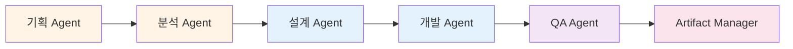

# Antigravity Multi-Agent System

이 디렉토리는 6개의 전문화된 AI 에이전트 규칙을 포함하고 있습니다. 각 에이전트는 소프트웨어 개발 생명주기(SDLC)의 특정 단계를 담당합니다.

## 🤖 에이전트 목록

### 1. 기획 Agent (Requirements Analyst)
**파일**: `01-pm-agent.md`  
**역할**: 요구사항 정의 및 문서화  
**주요 작업**:
- 요건정의서 작성
- 테스트 케이스(TC) 생성
- 용어 정의서 관리

**프롬프트 템플릿**: `prompt-for-requirement.md` 참조

### 2. 분석 Agent (Business Analyst)
**파일**: `02-logic-agent.md`  
**역할**: 비즈니스 분석 및 인터페이스 정의  
**주요 작업**:
- 인터페이스 정의서 작성
- 비즈니스 로직 상세화
- 데이터 모델 설계

### 3. 설계 Agent (System Architect)
**파일**: `03-interface-agent.md`  
**역할**: 시스템 아키텍처 설계  
**주요 작업**:
- OpenAPI Specification (OAS) 생성
- MSA 구성 설계
- 기술 스택 선정

### 4. 개발 Agent (Full-Stack Developer)
**파일**: `04-dev-agent.md`  
**역할**: 코드 구현 및 단위 테스트  
**주요 작업**:
- OAS 기반 코드 생성
- BDD 기반 개발
- Sanity 테스트 수행

### 5. QA Agent (Quality Assurance Specialist)
**파일**: `05-qa-agent.md`  
**역할**: 품질 보증 및 E2E 테스트  
**주요 작업**:
- TC 기반 E2E 테스트
- Playwright 자동화
- 테스트 리포트 생성

### 6. Artifact Manager (Documentation & Knowledge Keeper)
**파일**: `06-artifact-manager.md`  
**역할**: 산출물 관리 및 메타데이터 관리  
**주요 작업**:
- 산출물 인덱싱
- 메타데이터 생성
- 변경 이력 추적

---

## 🚀 에이전트 활성화 방법

### 방법 1: 순차적 활성화 (권장)

프로젝트 시작 시 다음 순서로 에이전트를 활성화합니다:

```markdown
1. @[antigravity/rules/01-pm-agent.md] 
   - 비즈니스 요청을 요건정의서로 변환
   - prompt-for-requirement.md 템플릿 사용

2. @[antigravity/rules/02-logic-agent.md]
   - 요건정의서 기반 인터페이스 정의

3. @[antigravity/rules/03-interface-agent.md]
   - OpenAPI 스펙 및 아키텍처 설계

4. @[antigravity/rules/04-dev-agent.md]
   - 코드 구현 및 단위 테스트

5. @[antigravity/rules/05-qa-agent.md]
   - E2E 테스트 및 품질 검증

6. @[antigravity/rules/06-artifact-manager.md]
   - 산출물 관리 및 문서화
```

### 방법 2: 특정 에이전트만 활성화

특정 단계만 필요한 경우:

```markdown
# 기획만 필요한 경우
@[antigravity/rules/01-pm-agent.md]
@[antigravity/rules/prompt-for-requirement.md]

# 개발만 필요한 경우
@[antigravity/rules/04-dev-agent.md]

# QA만 필요한 경우
@[antigravity/rules/05-qa-agent.md]
```

### 방법 3: 전체 에이전트 동시 활성화

모든 에이전트를 한 번에 활성화하려면 다음 명령어를 사용하세요:

```markdown
@[antigravity/rules/01-pm-agent.md]
@[antigravity/rules/02-logic-agent.md]
@[antigravity/rules/03-interface-agent.md]
@[antigravity/rules/04-dev-agent.md]
@[antigravity/rules/05-qa-agent.md]
@[antigravity/rules/06-artifact-manager.md]
```

---

## 📋 워크플로우



---

## 📝 사용 예시

### 새 프로젝트 시작

```markdown
# 1단계: 기획 Agent 활성화
@[antigravity/rules/01-pm-agent.md]

[대상 기능]
장바구니 수량 변경 및 가격 산정 기능을 개발하고 싶습니다.

# 2단계: 요건정의서 승인 후 분석 Agent 활성화
@[antigravity/rules/02-logic-agent.md]

요건정의서를 바탕으로 인터페이스를 정의해주세요.

# 3단계: 이후 순차적으로 진행...
```

### 특정 단계만 수행

```markdown
# QA만 수행하는 경우
@[antigravity/rules/05-qa-agent.md]

다음 TC를 기반으로 E2E 테스트를 작성해주세요:
- TC-001: 장바구니 상품 추가
- TC-002: 재고 부족 시 에러 처리
```

---

## 🔧 설정 파일

### prompt-for-requirement.md
기획 Agent가 사용하는 요건정의서 생성 프롬프트 템플릿입니다.

**사용 방법**:
1. `prompt-for-requirement.md` 파일 하단의 [대상 기능]에 원하는 기능 입력
2. 기획 Agent에게 전달
3. 자동으로 3가지 산출물 생성:
   - 업무요건 정의서
   - 핵심 예외 케이스 10선
   - 리스크 기반 테스트 케이스

---

## 📊 산출물 구조

각 에이전트가 생성하는 산출물은 다음 위치에 저장됩니다:

```
docs/
├── requirements/          # 기획 Agent
│   ├── requirements-spec.md
│   ├── test-cases.md
│   └── glossary.md
├── analysis/             # 분석 Agent
│   ├── interface-spec.md
│   ├── business-logic-detail.md
│   └── data-model.md
├── design/               # 설계 Agent
│   ├── openapi.yaml
│   ├── architecture.md
│   └── msa-design.md
├── dev/                  # 개발 Agent
│   └── sanity-test-report.md
├── qa/                   # QA Agent
│   ├── e2e-test-report.md
│   └── test-coverage.md
└── artifacts/            # Artifact Manager
    ├── artifact-index.md
    ├── metadata.json
    └── changelog.md
```

---

## 🎯 베스트 프랙티스

1. **순차적 진행**: 각 단계를 순서대로 진행하여 품질 보장
2. **사용자 승인**: 각 단계마다 HITL(Human-in-the-Loop) 승인 획득
3. **산출물 검증**: 다음 단계로 넘어가기 전 산출물 완성도 확인
4. **문서 동기화**: 코드 변경 시 관련 문서도 함께 업데이트

---

## 📚 참고 문서

- [Multi-Agent 개발 프로세스 가이드](../docs/work-process-with-agents.md)
- [프로젝트 컨텍스트](../backend/docs/project-context.md)
- [QA 테스트 리포트](../backend/docs/qa/test-report.md)

---

**마지막 업데이트**: 2026-02-06  
**버전**: 2.0
