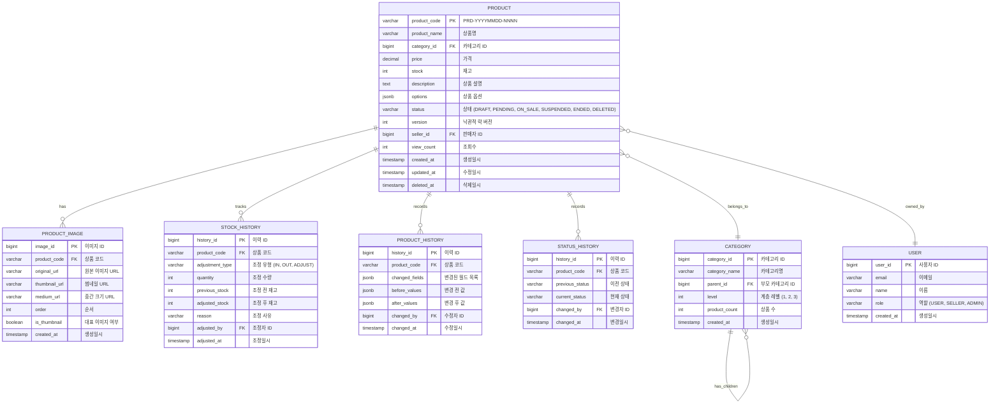

# 데이터 모델: 상품관리

**프로젝트명**: 차세대 플랫폼 - 상품관리  
**작성일**: 2026-02-06  
**작성자**: 분석 Agent  
**버전**: v1.0  
**기반 문서**: 요건정의서 v1.0, 인터페이스 정의서 v1.0

---

## 1. ERD (Entity Relationship Diagram)



---

## 2. 엔티티 상세 정의

### 2.1 PRODUCT (상품)

| 컬럼명 | 타입 | 길이 | NULL | 기본값 | 제약조건 | 설명 |
|--------|------|------|------|--------|---------|------|
| product_code | VARCHAR | 20 | N | - | PK, UNIQUE | 상품 코드 |
| product_name | VARCHAR | 100 | N | - | INDEX | 상품명 |
| category_id | BIGINT | - | N | - | FK, INDEX | 카테고리 ID |
| price | DECIMAL | (10,0) | N | - | CHECK (price >= 0) | 가격 (KRW) |
| stock | INTEGER | - | N | 0 | CHECK (stock >= 0) | 재고 수량 |
| description | TEXT | 5000 | Y | NULL | - | 상품 설명 |
| options | JSONB | - | Y | NULL | - | 상품 옵션 (key-value) |
| status | VARCHAR | 20 | N | 'DRAFT' | INDEX | 상태 |
| version | INTEGER | - | N | 1 | - | 낙관적 락 버전 |
| seller_id | BIGINT | - | N | - | FK, INDEX | 판매자 ID |
| view_count | INTEGER | - | N | 0 | - | 조회수 |
| created_at | TIMESTAMP | - | N | CURRENT_TIMESTAMP | INDEX | 생성일시 |
| updated_at | TIMESTAMP | - | N | CURRENT_TIMESTAMP | - | 수정일시 |
| deleted_at | TIMESTAMP | - | Y | NULL | - | 삭제일시 |

**인덱스**:
- `idx_product_name`: (product_name) - 상품명 검색
- `idx_category_id`: (category_id) - 카테고리별 조회
- `idx_status`: (status) - 상태별 조회
- `idx_created_at`: (created_at DESC) - 최신순 정렬
- `idx_seller_id`: (seller_id) - 판매자별 조회
- `idx_price`: (price) - 가격 범위 검색

**제약조건**:
- `chk_price_positive`: price >= 0
- `chk_stock_non_negative`: stock >= 0
- `chk_status_valid`: status IN ('DRAFT', 'PENDING', 'ON_SALE', 'SUSPENDED', 'ENDED', 'DELETED')

---

### 2.2 PRODUCT_IMAGE (상품 이미지)

| 컬럼명 | 타입 | 길이 | NULL | 기본값 | 제약조건 | 설명 |
|--------|------|------|------|--------|---------|------|
| image_id | BIGSERIAL | - | N | AUTO | PK | 이미지 ID |
| product_code | VARCHAR | 20 | N | - | FK, INDEX | 상품 코드 |
| original_url | VARCHAR | 500 | N | - | - | 원본 이미지 URL |
| thumbnail_url | VARCHAR | 500 | N | - | - | 썸네일 URL (200x200) |
| medium_url | VARCHAR | 500 | N | - | - | 중간 크기 URL (800x800) |
| order | INTEGER | - | N | 1 | - | 이미지 순서 |
| is_thumbnail | BOOLEAN | - | N | FALSE | - | 대표 이미지 여부 |
| created_at | TIMESTAMP | - | N | CURRENT_TIMESTAMP | - | 생성일시 |

**인덱스**:
- `idx_product_code_order`: (product_code, order) - 상품별 이미지 순서 조회

**제약조건**:
- `fk_product_image_product`: FOREIGN KEY (product_code) REFERENCES PRODUCT(product_code) ON DELETE CASCADE
- `uk_product_thumbnail`: UNIQUE (product_code, is_thumbnail) WHERE is_thumbnail = TRUE - 대표 이미지 1개만

---

### 2.3 STOCK_HISTORY (재고 이력)

| 컬럼명 | 타입 | 길이 | NULL | 기본값 | 제약조건 | 설명 |
|--------|------|------|------|--------|---------|------|
| history_id | BIGSERIAL | - | N | AUTO | PK | 이력 ID |
| product_code | VARCHAR | 20 | N | - | FK, INDEX | 상품 코드 |
| adjustment_type | VARCHAR | 10 | N | - | - | 조정 유형 |
| quantity | INTEGER | - | N | - | CHECK (quantity > 0) | 조정 수량 |
| previous_stock | INTEGER | - | N | - | - | 조정 전 재고 |
| adjusted_stock | INTEGER | - | N | - | - | 조정 후 재고 |
| reason | VARCHAR | 200 | N | - | - | 조정 사유 |
| adjusted_by | BIGINT | - | N | - | FK | 조정자 ID |
| adjusted_at | TIMESTAMP | - | N | CURRENT_TIMESTAMP | INDEX | 조정일시 |

**인덱스**:
- `idx_product_code_adjusted_at`: (product_code, adjusted_at DESC) - 상품별 이력 조회

**제약조건**:
- `chk_adjustment_type`: adjustment_type IN ('IN', 'OUT', 'ADJUST')
- `chk_quantity_positive`: quantity > 0

---

### 2.4 PRODUCT_HISTORY (상품 변경 이력)

| 컬럼명 | 타입 | 길이 | NULL | 기본값 | 제약조건 | 설명 |
|--------|------|------|------|--------|---------|------|
| history_id | BIGSERIAL | - | N | AUTO | PK | 이력 ID |
| product_code | VARCHAR | 20 | N | - | FK, INDEX | 상품 코드 |
| changed_fields | JSONB | - | N | - | - | 변경된 필드 목록 |
| before_values | JSONB | - | N | - | - | 변경 전 값 |
| after_values | JSONB | - | N | - | - | 변경 후 값 |
| changed_by | BIGINT | - | N | - | FK | 수정자 ID |
| changed_at | TIMESTAMP | - | N | CURRENT_TIMESTAMP | INDEX | 수정일시 |

**예시 데이터**:
```json
{
  "changed_fields": ["productName", "price"],
  "before_values": {
    "productName": "노트북",
    "price": 1500000
  },
  "after_values": {
    "productName": "삼성 노트북",
    "price": 1600000
  }
}
```

---

### 2.5 STATUS_HISTORY (상태 변경 이력)

| 컬럼명 | 타입 | 길이 | NULL | 기본값 | 제약조건 | 설명 |
|--------|------|------|------|--------|---------|------|
| history_id | BIGSERIAL | - | N | AUTO | PK | 이력 ID |
| product_code | VARCHAR | 20 | N | - | FK, INDEX | 상품 코드 |
| previous_status | VARCHAR | 20 | N | - | - | 이전 상태 |
| current_status | VARCHAR | 20 | N | - | - | 현재 상태 |
| changed_by | BIGINT | - | N | - | FK | 변경자 ID |
| changed_at | TIMESTAMP | - | N | CURRENT_TIMESTAMP | INDEX | 변경일시 |

---

### 2.6 CATEGORY (카테고리)

| 컬럼명 | 타입 | 길이 | NULL | 기본값 | 제약조건 | 설명 |
|--------|------|------|------|--------|---------|------|
| category_id | BIGSERIAL | - | N | AUTO | PK | 카테고리 ID |
| category_name | VARCHAR | 50 | N | - | - | 카테고리명 |
| parent_id | BIGINT | - | Y | NULL | FK | 부모 카테고리 ID |
| level | INTEGER | - | N | 1 | CHECK (level BETWEEN 1 AND 3) | 계층 레벨 |
| product_count | INTEGER | - | N | 0 | - | 상품 수 |
| created_at | TIMESTAMP | - | N | CURRENT_TIMESTAMP | - | 생성일시 |

**계층 구조 예시**:
```
전자제품 (level=1, parent_id=NULL)
  └─ 노트북 (level=2, parent_id=1)
      ├─ 게이밍 (level=3, parent_id=2)
      └─ 사무용 (level=3, parent_id=2)
```

---

## 3. 관계 정의

### 3.1 일대다 (1:N) 관계

| 부모 테이블 | 자식 테이블 | 관계 | 삭제 정책 |
|-----------|-----------|------|---------|
| PRODUCT | PRODUCT_IMAGE | 1:N | CASCADE |
| PRODUCT | STOCK_HISTORY | 1:N | RESTRICT |
| PRODUCT | PRODUCT_HISTORY | 1:N | RESTRICT |
| PRODUCT | STATUS_HISTORY | 1:N | RESTRICT |
| CATEGORY | PRODUCT | 1:N | RESTRICT |
| USER | PRODUCT | 1:N | RESTRICT |

### 3.2 자기 참조 관계

| 테이블 | 관계 | 설명 |
|--------|------|------|
| CATEGORY | 1:N (self) | 부모-자식 카테고리 |

---

## 4. 데이터 타입 선택 근거

| 타입 | 사용 이유 |
|------|---------|
| VARCHAR(20) | 상품 코드는 고정 길이 (PRD-YYYYMMDD-NNNN) |
| DECIMAL(10,0) | 가격은 정수만 사용, 최대 10억 원 |
| INTEGER | 재고, 조회수는 정수 |
| JSONB | 상품 옵션은 유연한 구조 필요, 인덱싱 가능 |
| TIMESTAMP | 일시는 타임존 포함 |
| BIGSERIAL | 자동 증가 ID, 대용량 대비 |

---

## 5. 파티셔닝 전략 (선택적)

### 5.1 PRODUCT 테이블 파티셔닝
- **파티션 키**: created_at (월별)
- **파티션 타입**: RANGE
- **보관 기간**: 최근 12개월

```sql
CREATE TABLE product_2026_02 PARTITION OF product
    FOR VALUES FROM ('2026-02-01') TO ('2026-03-01');
```

### 5.2 STOCK_HISTORY 테이블 파티셔닝
- **파티션 키**: adjusted_at (월별)
- **파티션 타입**: RANGE
- **보관 기간**: 최근 24개월

---

## 6. 샘플 데이터

### PRODUCT
```sql
INSERT INTO product (
    product_code, product_name, category_id, price, stock,
    description, status, seller_id, version
) VALUES (
    'PRD-20260206-0001',
    '삼성 노트북 갤럭시북',
    123,
    1500000,
    10,
    '최신 모델 노트북입니다.',
    'DRAFT',
    456,
    1
);
```

### PRODUCT_IMAGE
```sql
INSERT INTO product_image (
    product_code, original_url, thumbnail_url, medium_url,
    order, is_thumbnail
) VALUES (
    'PRD-20260206-0001',
    'https://cdn.example.com/products/PRD-20260206-0001/original.jpg',
    'https://cdn.example.com/products/PRD-20260206-0001/thumb.jpg',
    'https://cdn.example.com/products/PRD-20260206-0001/medium.jpg',
    1,
    TRUE
);
```

---

**다음 단계**: 시퀀스 다이어그램 작성
