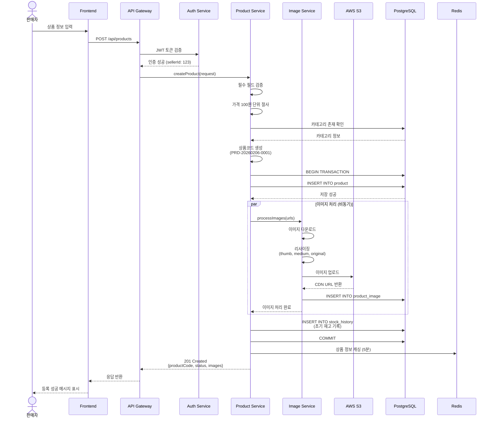
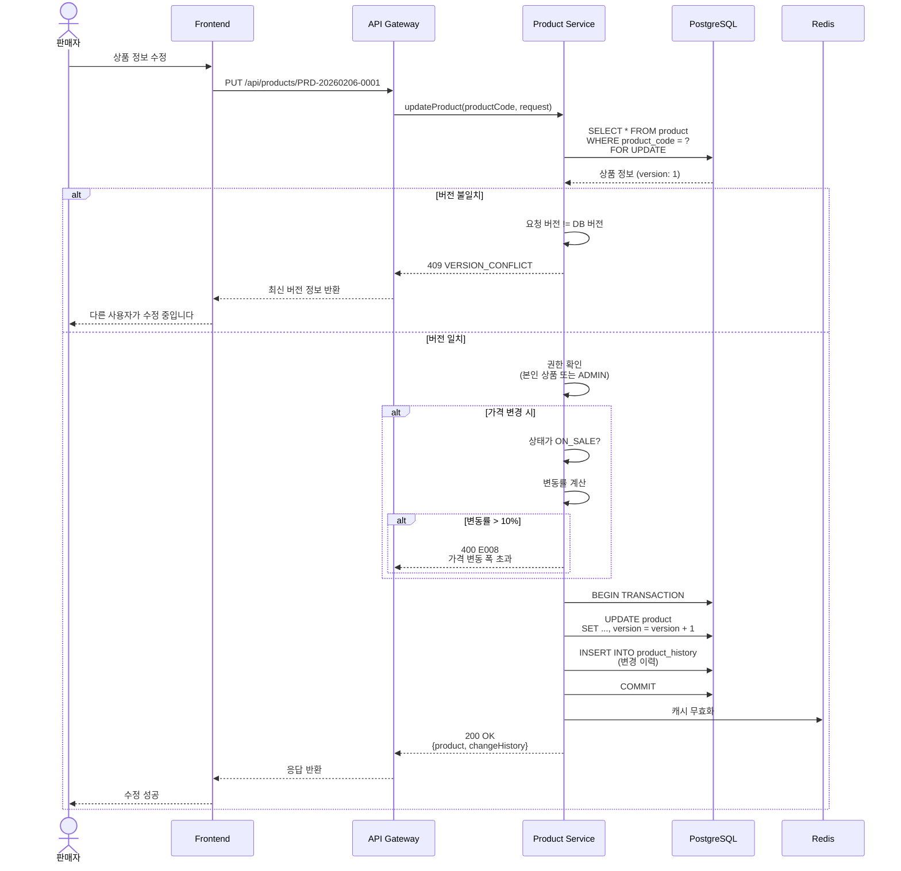
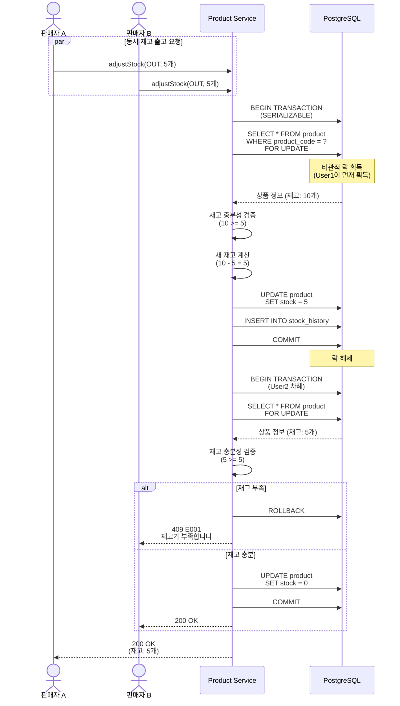
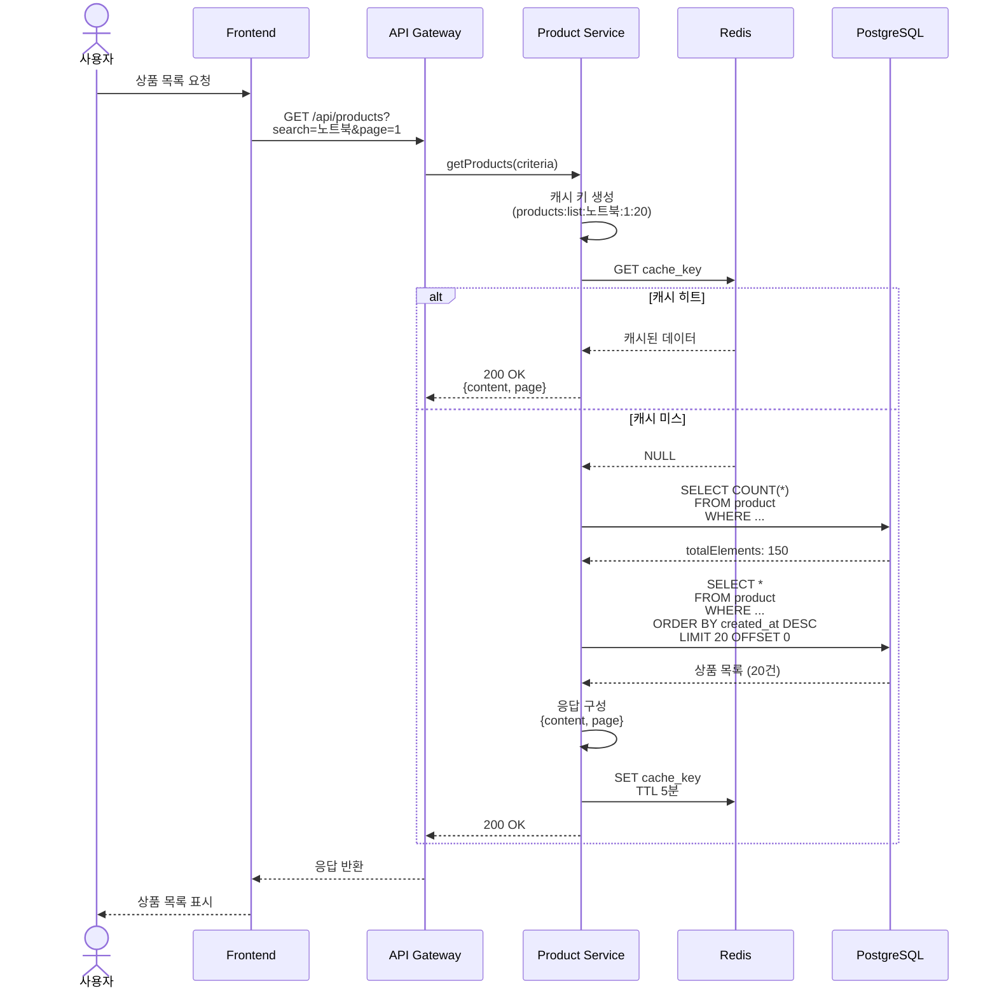
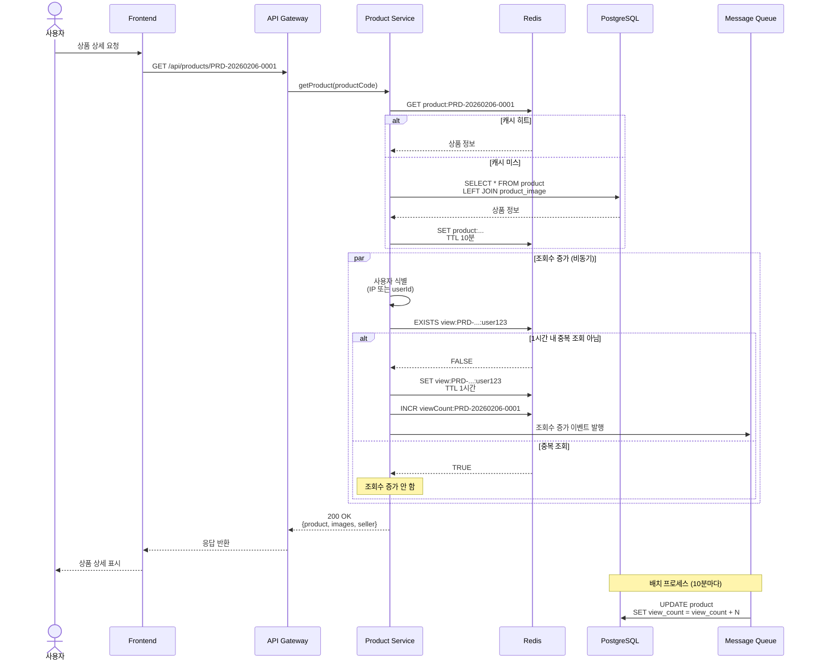
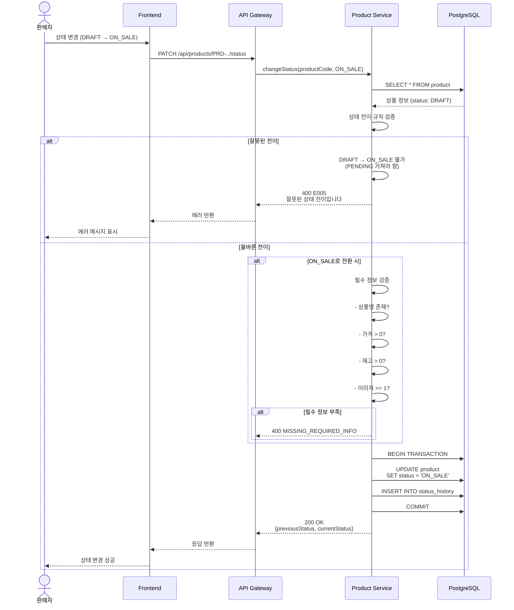
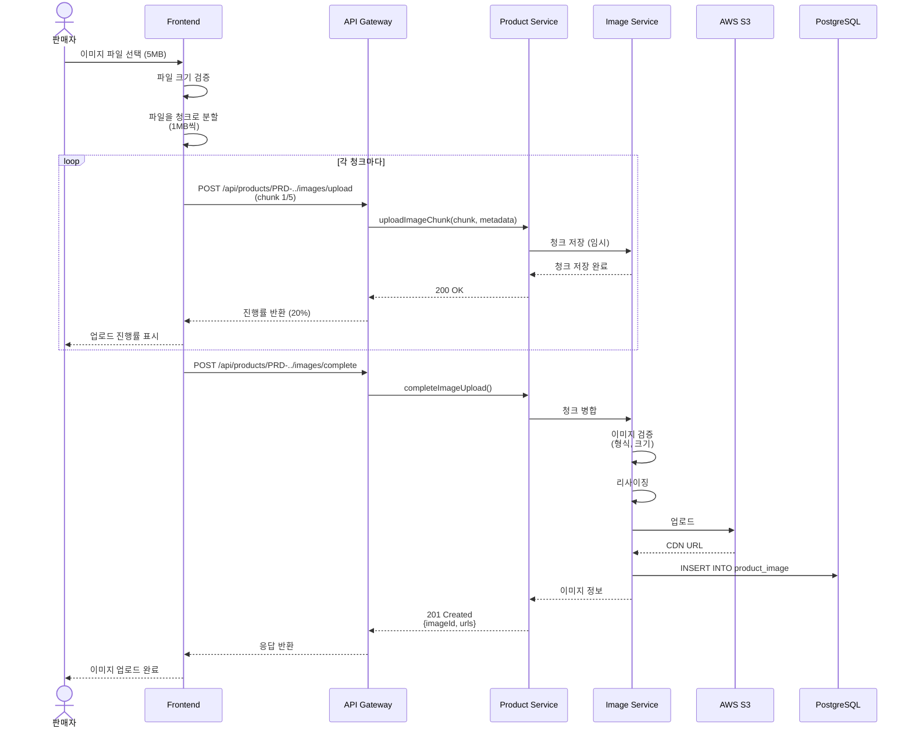

# 시퀀스 다이어그램: 상품관리

**프로젝트명**: 차세대 플랫폼 - 상품관리  
**작성일**: 2026-02-06  
**작성자**: 분석 Agent  
**버전**: v1.0  
**기반 문서**: 요건정의서 v1.0, 비즈니스 로직 상세 v1.0

---

## 1. 상품 등록 시퀀스

---

## 2. 상품 수정 시퀀스 (낙관적 락)

---

## 3. 재고 조정 시퀀스 (동시성 제어)

---

## 4. 상품 목록 조회 시퀀스 (캐싱)

---

## 5. 상품 상세 조회 시퀀스 (조회수 증가)

---

## 6. 상품 상태 변경 시퀀스 (상태 전이 검증)

---

## 7. 이미지 업로드 시퀀스 (청크 업로드)

---

**다음 단계**: 설계 Agent에게 인계하여 OpenAPI 스펙 작성
