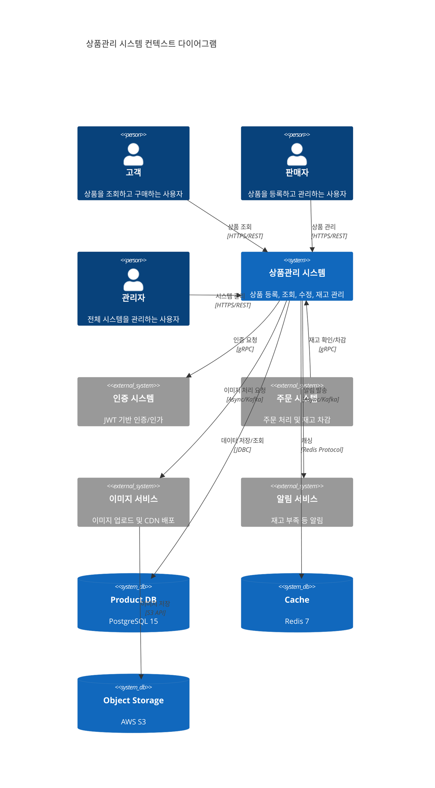
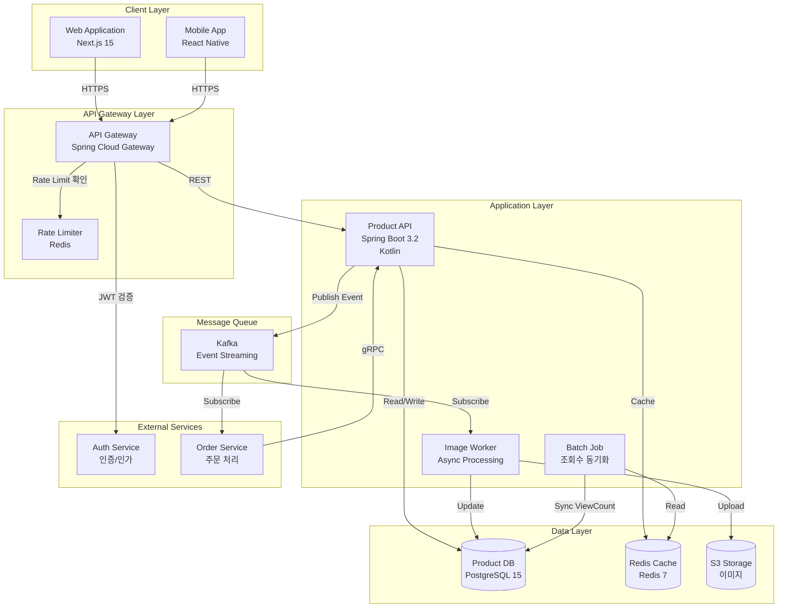
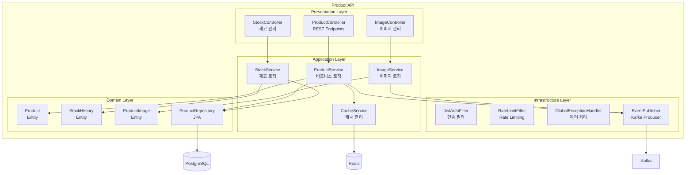
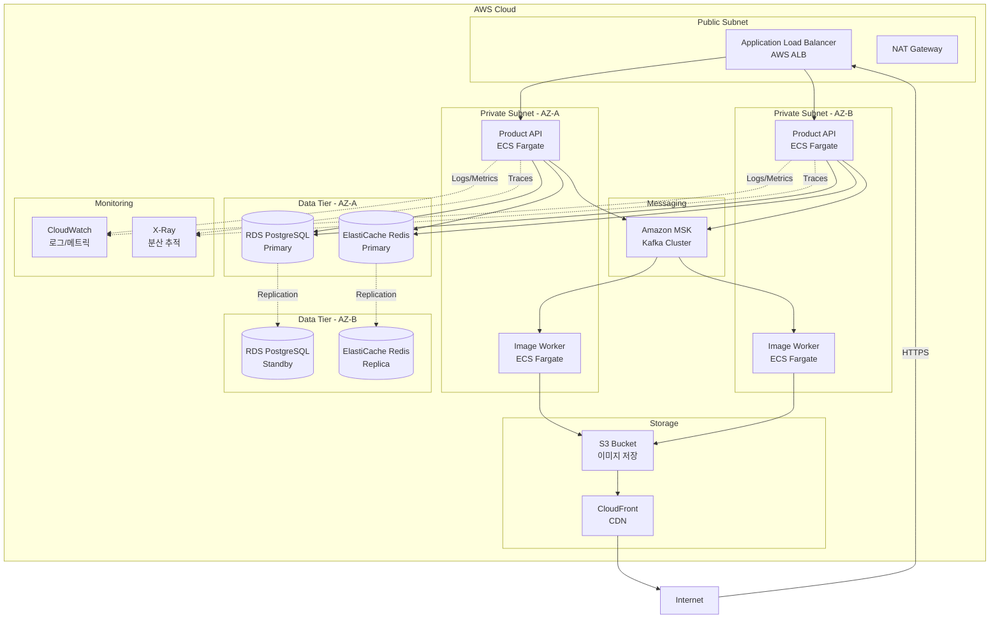
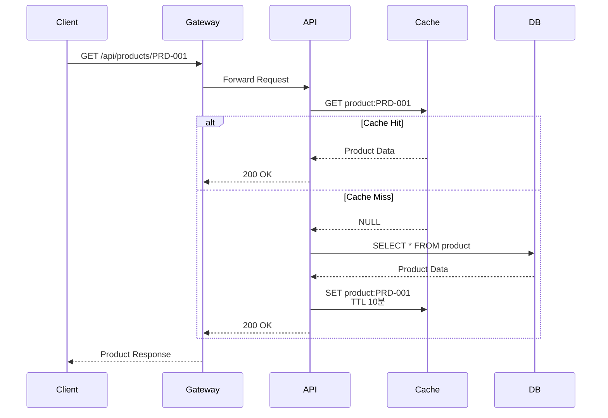
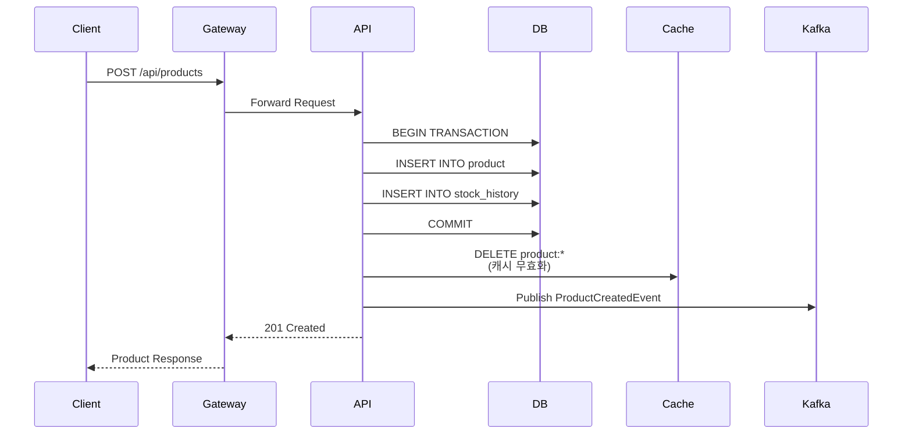
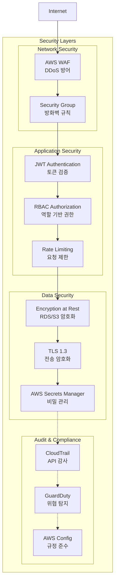
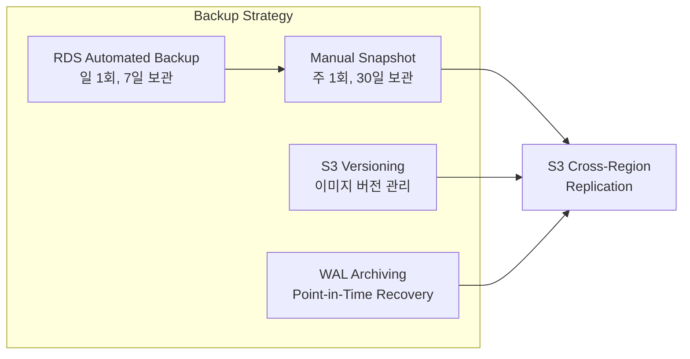
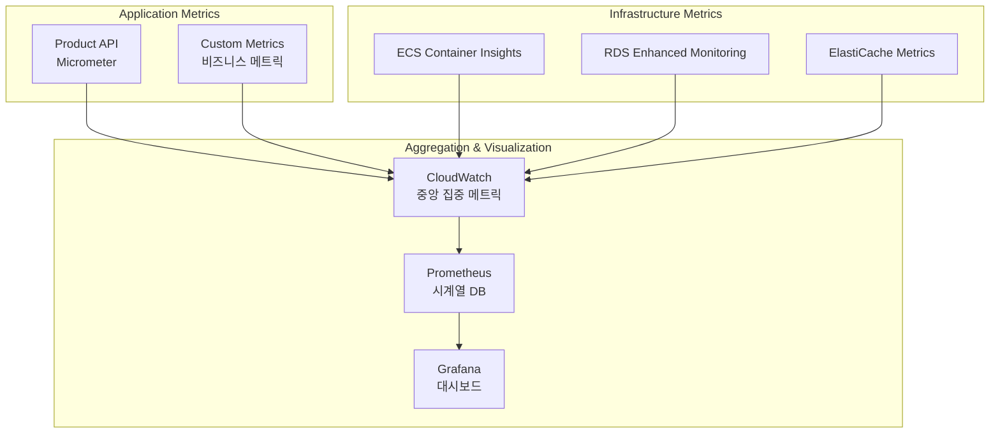

# 시스템 아키텍처: 상품관리

**프로젝트명**: 차세대 플랫폼 - 상품관리  
**작성일**: 2026-02-06  
**작성자**: 설계 Agent  
**버전**: v1.0  
**기반 문서**: 인터페이스 정의서 v1.0, 데이터 모델 v1.0

---

## 1. 전체 시스템 아키텍처



---

## 2. 컨테이너 다이어그램 (C4 Level 2)



---

## 3. 컴포넌트 다이어그램 (Product API 내부)



---

## 4. 배포 아키텍처



---

## 5. 데이터 흐름 아키텍처

### 5.1 읽기 경로 (Read Path)



### 5.2 쓰기 경로 (Write Path)



---

## 6. 보안 아키텍처



---

## 7. 확장성 전략

### 7.1 수평 확장 (Horizontal Scaling)

| 컴포넌트 | 확장 방식 | 트리거 | 목표 |
|---------|---------|--------|------|
| Product API | Auto Scaling Group | CPU > 70% | 2~10 인스턴스 |
| Image Worker | ECS Service Auto Scaling | Queue Depth > 100 | 1~5 인스턴스 |
| RDS Read Replica | 수동 추가 | Read 부하 > 80% | 최대 5개 |
| ElastiCache | Cluster Mode | 메모리 사용률 > 75% | 샤딩 |

### 7.2 수직 확장 (Vertical Scaling)

| 컴포넌트 | 현재 스펙 | 확장 스펙 | 조건 |
|---------|---------|---------|------|
| RDS Primary | db.t3.large | db.r5.xlarge | 연결 수 > 500 |
| ElastiCache | cache.t3.medium | cache.r5.large | 메모리 부족 |
| ECS Task | 2 vCPU, 4GB | 4 vCPU, 8GB | 응답 시간 > 1초 |

---

## 8. 고가용성 (High Availability)

### 8.1 장애 복구 시나리오

| 장애 유형 | 감지 방법 | 복구 방법 | RTO | RPO |
|---------|---------|---------|-----|-----|
| API 인스턴스 다운 | Health Check 실패 | Auto Scaling 재시작 | 1분 | 0 |
| RDS Primary 장애 | RDS Failover | Standby 승격 | 2분 | 0 |
| Redis 장애 | Connection Timeout | Replica 승격 | 30초 | 1분 |
| AZ 전체 장애 | Multi-AZ 감지 | 다른 AZ로 트래픽 전환 | 5분 | 0 |
| Region 장애 | Route53 Health Check | DR Region 활성화 | 30분 | 5분 |

### 8.2 백업 전략



---

## 9. 모니터링 및 관찰성 (Observability)

### 9.1 메트릭 수집



### 9.2 주요 모니터링 지표

| 카테고리 | 메트릭 | 임계값 | 알림 |
|---------|--------|--------|------|
| **성능** | API 응답 시간 | p95 > 500ms | Slack |
| **성능** | DB 쿼리 시간 | p99 > 1초 | Email |
| **가용성** | API 에러율 | > 1% | PagerDuty |
| **가용성** | Health Check 실패 | 연속 3회 | PagerDuty |
| **용량** | CPU 사용률 | > 80% | Slack |
| **용량** | 메모리 사용률 | > 85% | Slack |
| **비즈니스** | 상품 등록 실패율 | > 5% | Email |
| **비즈니스** | 재고 부족 발생 | 발생 시 | Slack |

---

## 10. 성능 최적화 전략

### 10.1 캐싱 전략

| 데이터 유형 | 캐시 위치 | TTL | 무효화 전략 |
|-----------|---------|-----|-----------|
| 상품 상세 | Redis | 10분 | Write-Through |
| 상품 목록 | Redis | 5분 | Time-based |
| 카테고리 | Redis | 1시간 | Manual |
| 조회수 | Redis | 실시간 | Batch Sync (10분) |

### 10.2 데이터베이스 최적화

```sql
-- 주요 인덱스
CREATE INDEX idx_product_name ON product(product_name);
CREATE INDEX idx_category_id ON product(category_id);
CREATE INDEX idx_status ON product(status);
CREATE INDEX idx_created_at ON product(created_at DESC);
CREATE INDEX idx_price ON product(price);

-- 복합 인덱스
CREATE INDEX idx_category_status ON product(category_id, status);
CREATE INDEX idx_status_created ON product(status, created_at DESC);

-- 파티셔닝 (월별)
CREATE TABLE product_2026_02 PARTITION OF product
    FOR VALUES FROM ('2026-02-01') TO ('2026-03-01');
```

### 10.3 쿼리 최적화

```kotlin
// N+1 문제 해결
@Query("SELECT p FROM Product p LEFT JOIN FETCH p.images WHERE p.productCode = :code")
fun findByProductCodeWithImages(code: String): Product?

// 페이징 최적화
@Query("SELECT p FROM Product p WHERE p.status != 'DELETED' ORDER BY p.createdAt DESC")
fun findAllActive(pageable: Pageable): Page<Product>

// 카운트 쿼리 분리
@Query(
    value = "SELECT p FROM Product p WHERE p.status != 'DELETED'",
    countQuery = "SELECT COUNT(p) FROM Product p WHERE p.status != 'DELETED'"
)
fun findAllWithCount(pageable: Pageable): Page<Product>
```

---

**다음 단계**: MSA 설계 문서 작성
