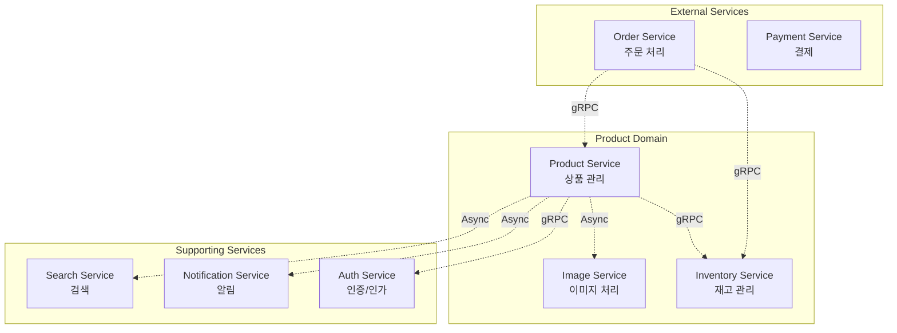
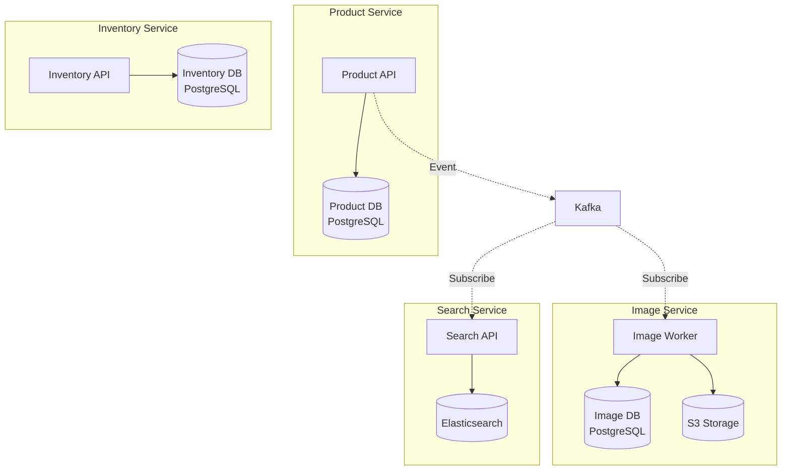
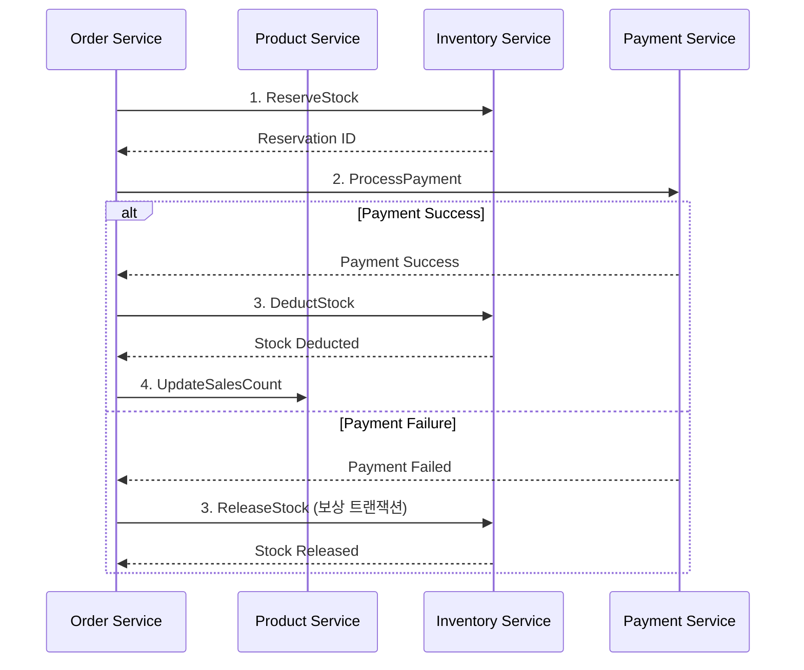
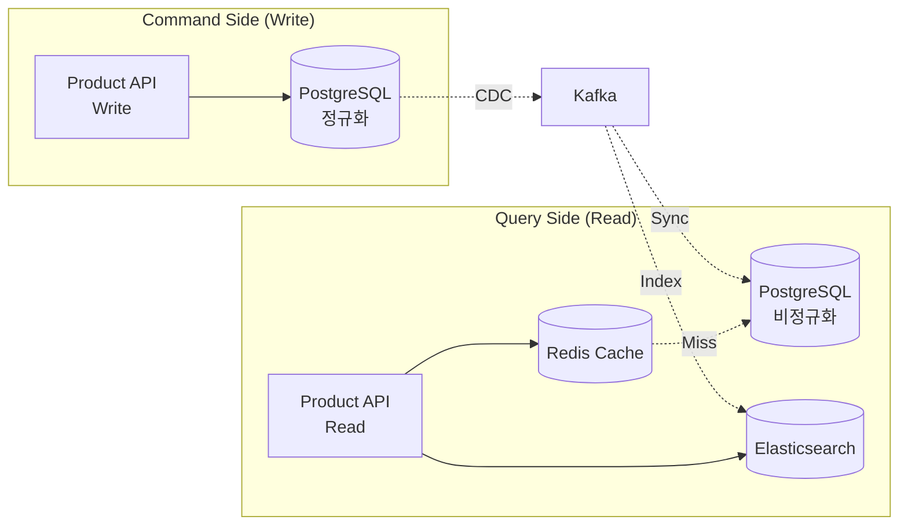
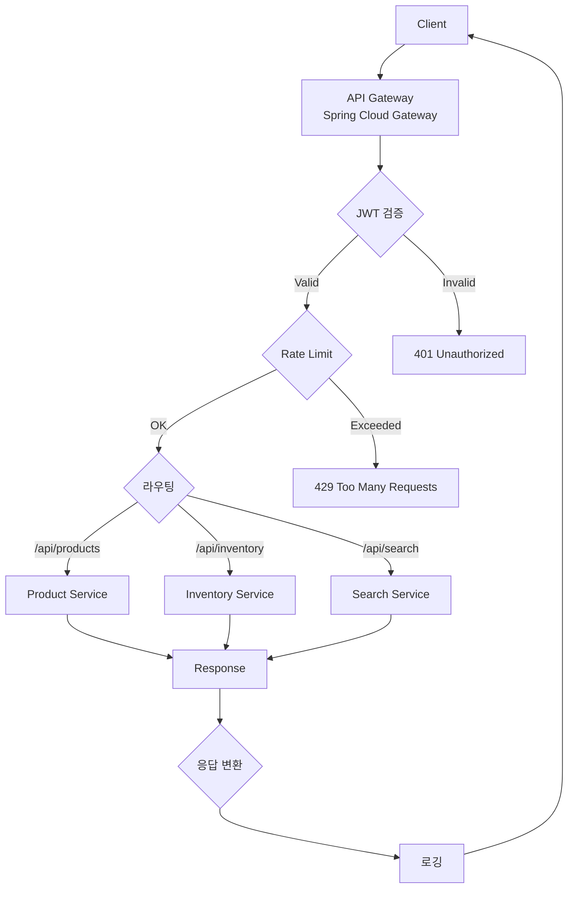
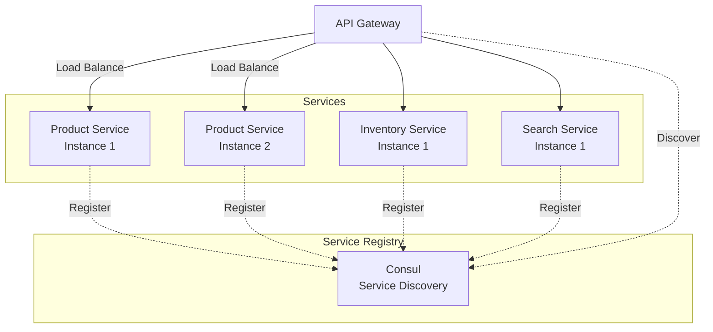
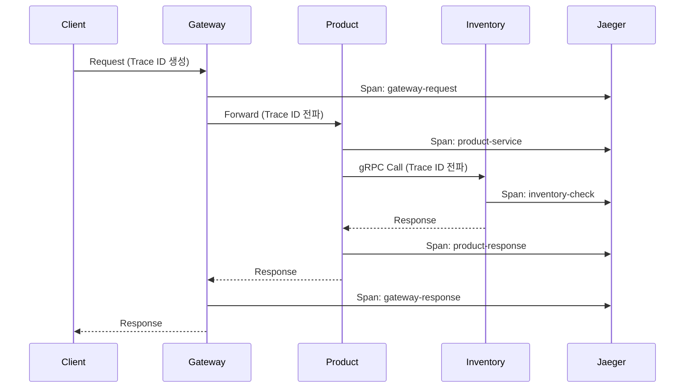
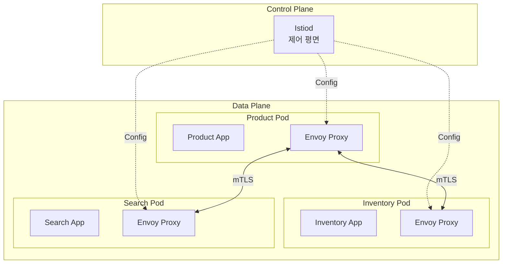

# MSA 설계: 상품관리

**프로젝트명**: 차세대 플랫폼 - 상품관리  
**작성일**: 2026-02-06  
**작성자**: 설계 Agent  
**버전**: v1.0  
**기반 문서**: 시스템 아키텍처 v1.0

---

## 1. 마이크로서비스 분리 전략

### 1.1 서비스 경계 정의 (Bounded Context)



### 1.2 서비스별 책임

| 서비스 | 책임 | 데이터 소유 | 통신 방식 |
|--------|------|-----------|---------|
| **Product Service** | 상품 CRUD, 상태 관리, 카테고리 관리 | Product, ProductHistory, Category | REST, gRPC |
| **Inventory Service** | 재고 조정, 재고 예약, 재고 이력 | Stock, StockHistory, Reservation | gRPC, Event |
| **Image Service** | 이미지 업로드, 리사이징, CDN 배포 | ProductImage, ImageMetadata | Async/Kafka |
| **Auth Service** | JWT 발급, 권한 검증, 사용자 관리 | User, Role, Permission | gRPC |
| **Notification Service** | 재고 부족 알림, 상태 변경 알림 | Notification, Template | Async/Kafka |
| **Search Service** | 전문 검색, 필터링, 추천 | ProductIndex (Elasticsearch) | REST |

---

## 2. 서비스 간 통신 패턴

### 2.1 동기 통신 (gRPC)

**사용 사례**: 실시간 데이터 필요, 강한 일관성 요구

```protobuf
// inventory.proto
syntax = "proto3";

package inventory;

service InventoryService {
  // 재고 확인
  rpc CheckStock(CheckStockRequest) returns (CheckStockResponse);
  
  // 재고 예약 (주문 시)
  rpc ReserveStock(ReserveStockRequest) returns (ReserveStockResponse);
  
  // 재고 예약 해제 (주문 취소 시)
  rpc ReleaseStock(ReleaseStockRequest) returns (ReleaseStockResponse);
  
  // 재고 차감 (주문 확정 시)
  rpc DeductStock(DeductStockRequest) returns (DeductStockResponse);
}

message CheckStockRequest {
  string product_code = 1;
  int32 quantity = 2;
}

message CheckStockResponse {
  bool available = 1;
  int32 current_stock = 2;
  string message = 3;
}

message ReserveStockRequest {
  string product_code = 1;
  int32 quantity = 2;
  string order_id = 3;
  int64 ttl_seconds = 4; // 예약 만료 시간
}

message ReserveStockResponse {
  bool success = 1;
  string reservation_id = 2;
  string message = 3;
}
```

### 2.2 비동기 통신 (Event-Driven)

**사용 사례**: 느슨한 결합, 최종 일관성 허용

```kotlin
// 이벤트 정의
sealed class ProductEvent {
    data class ProductCreated(
        val productCode: String,
        val productName: String,
        val categoryId: Long,
        val price: BigDecimal,
        val sellerId: Long,
        val timestamp: Instant
    ) : ProductEvent()
    
    data class ProductUpdated(
        val productCode: String,
        val changedFields: Map<String, Any>,
        val timestamp: Instant
    ) : ProductEvent()
    
    data class ProductStatusChanged(
        val productCode: String,
        val previousStatus: ProductStatus,
        val currentStatus: ProductStatus,
        val timestamp: Instant
    ) : ProductEvent()
    
    data class StockAdjusted(
        val productCode: String,
        val adjustmentType: AdjustmentType,
        val quantity: Int,
        val previousStock: Int,
        val currentStock: Int,
        val timestamp: Instant
    ) : ProductEvent()
}

// 이벤트 발행
@Service
class ProductEventPublisher(
    private val kafkaTemplate: KafkaTemplate<String, ProductEvent>
) {
    fun publishProductCreated(event: ProductEvent.ProductCreated) {
        kafkaTemplate.send("product.created", event.productCode, event)
    }
    
    fun publishStockAdjusted(event: ProductEvent.StockAdjusted) {
        kafkaTemplate.send("stock.adjusted", event.productCode, event)
    }
}
```

### 2.3 통신 패턴 선택 기준

| 요구사항 | 동기 (gRPC) | 비동기 (Kafka) |
|---------|-----------|--------------|
| **응답 시간** | < 100ms | 상관없음 |
| **일관성** | 강한 일관성 | 최종 일관성 |
| **결합도** | 높음 | 낮음 |
| **재시도** | 클라이언트 책임 | 자동 재시도 |
| **순서 보장** | 보장 안 됨 | 파티션 내 보장 |
| **사용 예시** | 재고 확인, 인증 | 이미지 처리, 알림 |

---

## 3. 데이터 관리 전략

### 3.1 Database per Service



### 3.2 데이터 일관성 패턴

#### Saga Pattern (재고 차감 시나리오)



#### CQRS Pattern (상품 조회 최적화)



---

## 4. API Gateway 설계

### 4.1 Gateway 책임



### 4.2 Gateway 설정 (Spring Cloud Gateway)

```yaml
spring:
  cloud:
    gateway:
      routes:
        # Product Service
        - id: product-service
          uri: lb://product-service
          predicates:
            - Path=/api/products/**
          filters:
            - name: RateLimiter
              args:
                redis-rate-limiter.replenishRate: 100
                redis-rate-limiter.burstCapacity: 200
            - name: CircuitBreaker
              args:
                name: productServiceCircuitBreaker
                fallbackUri: forward:/fallback/product
            - RewritePath=/api/products/(?<segment>.*), /$\{segment}
        
        # Inventory Service
        - id: inventory-service
          uri: lb://inventory-service
          predicates:
            - Path=/api/inventory/**
          filters:
            - name: RateLimiter
              args:
                redis-rate-limiter.replenishRate: 50
                redis-rate-limiter.burstCapacity: 100
            - RewritePath=/api/inventory/(?<segment>.*), /$\{segment}
        
        # Search Service
        - id: search-service
          uri: lb://search-service
          predicates:
            - Path=/api/search/**
          filters:
            - name: RateLimiter
              args:
                redis-rate-limiter.replenishRate: 200
                redis-rate-limiter.burstCapacity: 400
            - RewritePath=/api/search/(?<segment>.*), /$\{segment}
      
      default-filters:
        - name: GlobalFilter
        - name: JwtAuthenticationFilter
        - name: RequestLoggingFilter
```

---

## 5. 서비스 디스커버리 및 로드 밸런싱

### 5.1 Service Discovery (Consul)



### 5.2 로드 밸런싱 전략

| 전략 | 사용 사례 | 장점 | 단점 |
|------|---------|------|------|
| **Round Robin** | 균등한 부하 분산 | 간단, 공평 | 서버 성능 차이 무시 |
| **Least Connections** | 장시간 연결 | 부하 균형 우수 | 오버헤드 |
| **Weighted Round Robin** | 서버 성능 차이 | 유연성 | 가중치 설정 필요 |
| **IP Hash** | 세션 유지 | 일관성 | 부하 불균형 가능 |

**선택**: Product Service는 Round Robin, Inventory Service는 Least Connections

---

## 6. 장애 격리 및 복원력 (Resilience)

### 6.1 Circuit Breaker Pattern

```kotlin
@Service
class ProductService(
    private val inventoryClient: InventoryClient
) {
    @CircuitBreaker(
        name = "inventoryService",
        fallbackMethod = "getStockFallback"
    )
    @Retry(name = "inventoryService", fallbackMethod = "getStockFallback")
    @TimeLimiter(name = "inventoryService")
    fun getStock(productCode: String): Int {
        return inventoryClient.checkStock(productCode).currentStock
    }
    
    private fun getStockFallback(
        productCode: String,
        ex: Exception
    ): Int {
        logger.warn("Inventory service unavailable, using cached stock", ex)
        return cacheService.getCachedStock(productCode) ?: 0
    }
}
```

**Resilience4j 설정**:
```yaml
resilience4j:
  circuitbreaker:
    instances:
      inventoryService:
        registerHealthIndicator: true
        slidingWindowSize: 10
        minimumNumberOfCalls: 5
        permittedNumberOfCallsInHalfOpenState: 3
        automaticTransitionFromOpenToHalfOpenEnabled: true
        waitDurationInOpenState: 10s
        failureRateThreshold: 50
        eventConsumerBufferSize: 10
  
  retry:
    instances:
      inventoryService:
        maxAttempts: 3
        waitDuration: 500ms
        enableExponentialBackoff: true
        exponentialBackoffMultiplier: 2
  
  timelimiter:
    instances:
      inventoryService:
        timeoutDuration: 2s
```

### 6.2 Bulkhead Pattern

```kotlin
@Configuration
class BulkheadConfig {
    @Bean
    fun inventoryThreadPool(): ThreadPoolTaskExecutor {
        return ThreadPoolTaskExecutor().apply {
            corePoolSize = 10
            maxPoolSize = 20
            queueCapacity = 100
            setThreadNamePrefix("inventory-")
            initialize()
        }
    }
    
    @Bean
    fun imageThreadPool(): ThreadPoolTaskExecutor {
        return ThreadPoolTaskExecutor().apply {
            corePoolSize = 5
            maxPoolSize = 10
            queueCapacity = 50
            setThreadNamePrefix("image-")
            initialize()
        }
    }
}
```

---

## 7. 분산 추적 (Distributed Tracing)

### 7.1 OpenTelemetry 통합



### 7.2 Trace Context 전파

```kotlin
@Component
class TraceContextPropagator {
    fun propagateToGrpc(context: Context): Metadata {
        val metadata = Metadata()
        val traceId = context.get("trace-id")
        val spanId = context.get("span-id")
        
        metadata.put(
            Metadata.Key.of("trace-id", Metadata.ASCII_STRING_MARSHALLER),
            traceId
        )
        metadata.put(
            Metadata.Key.of("span-id", Metadata.ASCII_STRING_MARSHALLER),
            spanId
        )
        
        return metadata
    }
    
    fun propagateToKafka(context: Context): Headers {
        val headers = RecordHeaders()
        headers.add("trace-id", context.get("trace-id").toByteArray())
        headers.add("span-id", context.get("span-id").toByteArray())
        return headers
    }
}
```

---

## 8. 서비스 메시 (Service Mesh) - Istio

### 8.1 Istio 아키텍처



### 8.2 Istio 기능 활용

| 기능 | 설명 | 설정 |
|------|------|------|
| **Traffic Management** | 트래픽 라우팅, 카나리 배포 | VirtualService, DestinationRule |
| **Security** | mTLS, 인증/인가 | PeerAuthentication, AuthorizationPolicy |
| **Observability** | 메트릭, 로그, 추적 | Telemetry, EnvoyFilter |
| **Resilience** | Retry, Timeout, Circuit Breaker | VirtualService |

**VirtualService 예시**:
```yaml
apiVersion: networking.istio.io/v1beta1
kind: VirtualService
metadata:
  name: product-service
spec:
  hosts:
    - product-service
  http:
    - match:
        - headers:
            version:
              exact: v2
      route:
        - destination:
            host: product-service
            subset: v2
          weight: 10
        - destination:
            host: product-service
            subset: v1
          weight: 90
    - route:
        - destination:
            host: product-service
            subset: v1
```

---

**다음 단계**: 기술 스택 문서 작성
