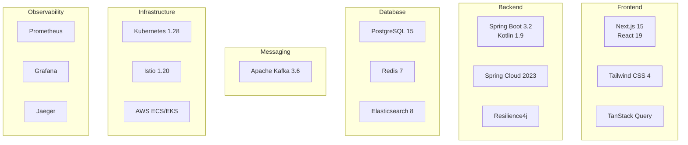

# 기술 스택: 상품관리

**프로젝트명**: 차세대 플랫폼 - 상품관리  
**작성일**: 2026-02-06  
**작성자**: 설계 Agent  
**버전**: v1.0  
**기반 문서**: 시스템 아키텍처 v1.0, MSA 설계 v1.0

---

## 1. 기술 스택 개요



---

## 2. Backend 기술 스택

### 2.1 Core Framework

| 기술 | 버전 | 목적 | 선정 이유 |
|------|------|------|---------|
| **Spring Boot** | 3.2.2 | 애플리케이션 프레임워크 | - 엔터프라이즈급 안정성<br/>- 풍부한 생태계<br/>- Auto-configuration |
| **Kotlin** | 1.9.22 | 프로그래밍 언어 | - Null Safety<br/>- 간결한 문법<br/>- Coroutine 지원 |
| **Spring Data JPA** | 3.2.2 | ORM | - 생산성 향상<br/>- 쿼리 메서드<br/>- Auditing 지원 |
| **Spring WebFlux** | 3.2.2 | 비동기 웹 | - 높은 동시성<br/>- Reactive Streams<br/>- Backpressure |

**build.gradle.kts**:
```kotlin
plugins {
    kotlin("jvm") version "1.9.22"
    kotlin("plugin.spring") version "1.9.22"
    kotlin("plugin.jpa") version "1.9.22"
    id("org.springframework.boot") version "3.2.2"
    id("io.spring.dependency-management") version "1.1.4"
}

dependencies {
    // Spring Boot
    implementation("org.springframework.boot:spring-boot-starter-web")
    implementation("org.springframework.boot:spring-boot-starter-data-jpa")
    implementation("org.springframework.boot:spring-boot-starter-validation")
    implementation("org.springframework.boot:spring-boot-starter-security")
    
    // Kotlin
    implementation("org.jetbrains.kotlin:kotlin-reflect")
    implementation("org.jetbrains.kotlin:kotlin-stdlib-jdk8")
    implementation("com.fasterxml.jackson.module:jackson-module-kotlin")
    
    // Database
    implementation("org.postgresql:postgresql:42.7.1")
    implementation("com.zaxxer:HikariCP:5.1.0")
    
    // Redis
    implementation("org.springframework.boot:spring-boot-starter-data-redis")
    implementation("io.lettuce:lettuce-core:6.3.1.RELEASE")
    
    // Kafka
    implementation("org.springframework.kafka:spring-kafka:3.1.1")
    
    // Testing
    testImplementation("org.springframework.boot:spring-boot-starter-test")
    testImplementation("io.kotest:kotest-runner-junit5:5.8.0")
    testImplementation("io.kotest:kotest-assertions-core:5.8.0")
    testImplementation("io.mockk:mockk:1.13.9")
}
```

### 2.2 Microservices Stack

| 기술 | 버전 | 목적 | 설정 |
|------|------|------|------|
| **Spring Cloud Gateway** | 4.1.0 | API Gateway | Rate Limiting, Circuit Breaker |
| **Spring Cloud Config** | 4.1.0 | 중앙 설정 관리 | Git Backend |
| **Consul** | 1.17 | Service Discovery | Health Check, KV Store |
| **gRPC** | 1.60.0 | 서비스 간 통신 | Protobuf, Streaming |
| **Resilience4j** | 2.2.0 | 장애 격리 | Circuit Breaker, Retry, Bulkhead |

**application.yml**:
```yaml
spring:
  application:
    name: product-service
  
  cloud:
    consul:
      host: localhost
      port: 8500
      discovery:
        enabled: true
        health-check-interval: 10s
        instance-id: ${spring.application.name}:${random.value}
    
    config:
      enabled: true
      uri: http://config-server:8888
      fail-fast: true
      retry:
        max-attempts: 6
        initial-interval: 1000

grpc:
  server:
    port: 9090
  client:
    inventory-service:
      address: static://inventory-service:9090
      negotiationType: PLAINTEXT
```

### 2.3 Database & Caching

| 기술 | 버전 | 목적 | 특징 |
|------|------|------|------|
| **PostgreSQL** | 15.5 | 주 데이터베이스 | - JSONB 지원<br/>- Partitioning<br/>- Full-Text Search |
| **Redis** | 7.2 | 캐싱, 세션 | - Pub/Sub<br/>- Sorted Set<br/>- Lua Script |
| **Elasticsearch** | 8.11 | 검색 엔진 | - Full-Text Search<br/>- Aggregation<br/>- Geo Search |
| **HikariCP** | 5.1.0 | Connection Pool | - 빠른 성능<br/>- 낮은 오버헤드 |

**데이터베이스 설정**:
```yaml
spring:
  datasource:
    url: jdbc:postgresql://localhost:5432/product_db
    username: ${DB_USERNAME}
    password: ${DB_PASSWORD}
    driver-class-name: org.postgresql.Driver
    hikari:
      maximum-pool-size: 20
      minimum-idle: 5
      connection-timeout: 30000
      idle-timeout: 600000
      max-lifetime: 1800000
      pool-name: ProductHikariPool
  
  jpa:
    hibernate:
      ddl-auto: validate
    properties:
      hibernate:
        dialect: org.hibernate.dialect.PostgreSQLDialect
        format_sql: true
        use_sql_comments: true
        jdbc:
          batch_size: 20
        order_inserts: true
        order_updates: true
  
  data:
    redis:
      host: localhost
      port: 6379
      password: ${REDIS_PASSWORD}
      lettuce:
        pool:
          max-active: 10
          max-idle: 5
          min-idle: 2
```

### 2.4 Messaging & Event Streaming

| 기술 | 버전 | 목적 | 토픽 구조 |
|------|------|------|---------|
| **Apache Kafka** | 3.6.1 | 이벤트 스트리밍 | product.*, stock.*, image.* |
| **Kafka Streams** | 3.6.1 | 스트림 처리 | 실시간 집계 |
| **Schema Registry** | 7.5.0 | 스키마 관리 | Avro, Protobuf |

**Kafka 설정**:
```yaml
spring:
  kafka:
    bootstrap-servers: localhost:9092
    producer:
      key-serializer: org.apache.kafka.common.serialization.StringSerializer
      value-serializer: org.springframework.kafka.support.serializer.JsonSerializer
      acks: all
      retries: 3
      properties:
        enable.idempotence: true
        max.in.flight.requests.per.connection: 5
    
    consumer:
      group-id: product-service-group
      key-deserializer: org.apache.kafka.common.serialization.StringDeserializer
      value-deserializer: org.springframework.kafka.support.serializer.JsonDeserializer
      auto-offset-reset: earliest
      enable-auto-commit: false
      properties:
        spring.json.trusted.packages: com.example.product.event
    
    listener:
      ack-mode: manual
      concurrency: 3
```

**토픽 구조**:
```
product.created          # 상품 생성 이벤트
product.updated          # 상품 수정 이벤트
product.status.changed   # 상태 변경 이벤트
stock.adjusted           # 재고 조정 이벤트
stock.reserved           # 재고 예약 이벤트
image.uploaded           # 이미지 업로드 이벤트
image.processed          # 이미지 처리 완료 이벤트
```

---

## 3. Frontend 기술 스택

### 3.1 Core Framework

| 기술 | 버전 | 목적 | 선정 이유 |
|------|------|------|---------|
| **Next.js** | 15.0 | React 프레임워크 | - SSR/SSG<br/>- App Router<br/>- Server Components |
| **React** | 19.0 | UI 라이브러리 | - Virtual DOM<br/>- Hooks<br/>- Concurrent Features |
| **TypeScript** | 5.3 | 타입 시스템 | - 타입 안정성<br/>- IDE 지원<br/>- 리팩토링 용이 |
| **Tailwind CSS** | 4.0 | CSS 프레임워크 | - Utility-First<br/>- JIT 컴파일<br/>- 작은 번들 크기 |

**package.json**:
```json
{
  "dependencies": {
    "next": "^15.0.0",
    "react": "^19.0.0",
    "react-dom": "^19.0.0",
    "@tanstack/react-query": "^5.17.0",
    "axios": "^1.6.5",
    "zod": "^3.22.4",
    "react-hook-form": "^7.49.3",
    "zustand": "^4.4.7"
  },
  "devDependencies": {
    "typescript": "^5.3.3",
    "@types/react": "^19.0.0",
    "@types/node": "^20.10.6",
    "tailwindcss": "^4.0.0",
    "eslint": "^8.56.0",
    "prettier": "^3.1.1",
    "playwright": "^1.40.1"
  }
}
```

### 3.2 State Management & Data Fetching

| 기술 | 버전 | 목적 | 사용 사례 |
|------|------|------|---------|
| **TanStack Query** | 5.17 | 서버 상태 관리 | API 데이터 캐싱, 동기화 |
| **Zustand** | 4.4 | 클라이언트 상태 관리 | UI 상태, 전역 상태 |
| **Zod** | 3.22 | 스키마 검증 | 폼 검증, API 응답 검증 |
| **React Hook Form** | 7.49 | 폼 관리 | 상품 등록/수정 폼 |

**TanStack Query 설정**:
```typescript
// app/providers.tsx
'use client'

import { QueryClient, QueryClientProvider } from '@tanstack/react-query'
import { ReactQueryDevtools } from '@tanstack/react-query-devtools'

const queryClient = new QueryClient({
  defaultOptions: {
    queries: {
      staleTime: 60 * 1000, // 1분
      gcTime: 5 * 60 * 1000, // 5분
      retry: 3,
      refetchOnWindowFocus: false,
    },
  },
})

export function Providers({ children }: { children: React.ReactNode }) {
  return (
    <QueryClientProvider client={queryClient}>
      {children}
      <ReactQueryDevtools initialIsOpen={false} />
    </QueryClientProvider>
  )
}
```

---

## 4. Infrastructure 기술 스택

### 4.1 Container & Orchestration

| 기술 | 버전 | 목적 | 특징 |
|------|------|------|------|
| **Docker** | 24.0 | 컨테이너화 | Multi-stage Build |
| **Kubernetes** | 1.28 | 오케스트레이션 | Auto-scaling, Self-healing |
| **Helm** | 3.13 | 패키지 관리 | Chart 버전 관리 |
| **Istio** | 1.20 | Service Mesh | mTLS, Traffic Management |

**Dockerfile (Multi-stage)**:
```dockerfile
# Build Stage
FROM gradle:8.5-jdk21 AS build
WORKDIR /app
COPY build.gradle.kts settings.gradle.kts ./
COPY src ./src
RUN gradle build --no-daemon -x test

# Runtime Stage
FROM eclipse-temurin:21-jre-alpine
WORKDIR /app
COPY --from=build /app/build/libs/*.jar app.jar
EXPOSE 8080 9090
ENTRYPOINT ["java", "-jar", "app.jar"]
```

**Kubernetes Deployment**:
```yaml
apiVersion: apps/v1
kind: Deployment
metadata:
  name: product-service
  labels:
    app: product-service
spec:
  replicas: 3
  selector:
    matchLabels:
      app: product-service
  template:
    metadata:
      labels:
        app: product-service
        version: v1
    spec:
      containers:
        - name: product-service
          image: product-service:1.0.0
          ports:
            - containerPort: 8080
              name: http
            - containerPort: 9090
              name: grpc
          env:
            - name: SPRING_PROFILES_ACTIVE
              value: production
            - name: DB_PASSWORD
              valueFrom:
                secretKeyRef:
                  name: db-secret
                  key: password
          resources:
            requests:
              memory: "512Mi"
              cpu: "500m"
            limits:
              memory: "1Gi"
              cpu: "1000m"
          livenessProbe:
            httpGet:
              path: /actuator/health/liveness
              port: 8080
            initialDelaySeconds: 30
            periodSeconds: 10
          readinessProbe:
            httpGet:
              path: /actuator/health/readiness
              port: 8080
            initialDelaySeconds: 20
            periodSeconds: 5
```

### 4.2 CI/CD

| 기술 | 버전 | 목적 | 파이프라인 |
|------|------|------|-----------|
| **GitHub Actions** | - | CI/CD | Build → Test → Deploy |
| **ArgoCD** | 2.9 | GitOps | Kubernetes 배포 자동화 |
| **SonarQube** | 10.3 | 코드 품질 | 정적 분석, 커버리지 |
| **Trivy** | 0.48 | 보안 스캔 | 컨테이너 취약점 스캔 |

**GitHub Actions Workflow**:
```yaml
name: CI/CD Pipeline

on:
  push:
    branches: [main, develop]
  pull_request:
    branches: [main]

jobs:
  build-and-test:
    runs-on: ubuntu-latest
    steps:
      - uses: actions/checkout@v4
      
      - name: Set up JDK 21
        uses: actions/setup-java@v4
        with:
          java-version: '21'
          distribution: 'temurin'
      
      - name: Build with Gradle
        run: ./gradlew build
      
      - name: Run Tests
        run: ./gradlew test
      
      - name: SonarQube Scan
        run: ./gradlew sonarqube
        env:
          SONAR_TOKEN: ${{ secrets.SONAR_TOKEN }}
      
      - name: Build Docker Image
        run: docker build -t product-service:${{ github.sha }} .
      
      - name: Scan with Trivy
        run: trivy image product-service:${{ github.sha }}
      
      - name: Push to ECR
        run: |
          aws ecr get-login-password | docker login --username AWS --password-stdin ${{ secrets.ECR_REGISTRY }}
          docker push product-service:${{ github.sha }}
```

---

## 5. Observability 기술 스택

### 5.1 Monitoring & Alerting

| 기술 | 버전 | 목적 | 메트릭 |
|------|------|------|--------|
| **Prometheus** | 2.48 | 메트릭 수집 | CPU, Memory, Request Rate |
| **Grafana** | 10.2 | 시각화 | 대시보드, 알림 |
| **AlertManager** | 0.26 | 알림 관리 | Slack, Email, PagerDuty |
| **Micrometer** | 1.12 | 메트릭 라이브러리 | Spring Boot 통합 |

**Prometheus 설정**:
```yaml
global:
  scrape_interval: 15s
  evaluation_interval: 15s

scrape_configs:
  - job_name: 'product-service'
    kubernetes_sd_configs:
      - role: pod
    relabel_configs:
      - source_labels: [__meta_kubernetes_pod_label_app]
        action: keep
        regex: product-service
      - source_labels: [__meta_kubernetes_pod_annotation_prometheus_io_scrape]
        action: keep
        regex: true
      - source_labels: [__meta_kubernetes_pod_annotation_prometheus_io_path]
        action: replace
        target_label: __metrics_path__
        regex: (.+)
```

### 5.2 Logging

| 기술 | 버전 | 목적 | 특징 |
|------|------|------|------|
| **Logback** | 1.4 | 로깅 프레임워크 | Async Appender |
| **Fluentd** | 1.16 | 로그 수집 | Kubernetes DaemonSet |
| **Elasticsearch** | 8.11 | 로그 저장 | Full-Text Search |
| **Kibana** | 8.11 | 로그 분석 | 대시보드, 검색 |

**Logback 설정 (logback-spring.xml)**:
```xml
<configuration>
    <appender name="CONSOLE" class="ch.qos.logback.core.ConsoleAppender">
        <encoder class="net.logstash.logback.encoder.LogstashEncoder">
            <includeMdcKeyName>trace-id</includeMdcKeyName>
            <includeMdcKeyName>span-id</includeMdcKeyName>
        </encoder>
    </appender>
    
    <appender name="ASYNC" class="ch.qos.logback.classic.AsyncAppender">
        <appender-ref ref="CONSOLE" />
        <queueSize>512</queueSize>
        <discardingThreshold>0</discardingThreshold>
    </appender>
    
    <root level="INFO">
        <appender-ref ref="ASYNC" />
    </root>
</configuration>
```

### 5.3 Distributed Tracing

| 기술 | 버전 | 목적 | 통합 |
|------|------|------|------|
| **OpenTelemetry** | 1.33 | 추적 표준 | Auto-instrumentation |
| **Jaeger** | 1.52 | 추적 백엔드 | UI, 쿼리 |
| **Zipkin** | 2.24 | 추적 백엔드 (대안) | UI, 쿼리 |

---

## 6. 개발 환경 설정

### 6.1 로컬 개발 환경 (Docker Compose)

```yaml
version: '3.8'

services:
  postgres:
    image: postgres:15-alpine
    environment:
      POSTGRES_DB: product_db
      POSTGRES_USER: postgres
      POSTGRES_PASSWORD: postgres
    ports:
      - "5432:5432"
    volumes:
      - postgres_data:/var/lib/postgresql/data
  
  redis:
    image: redis:7-alpine
    ports:
      - "6379:6379"
  
  kafka:
    image: confluentinc/cp-kafka:7.5.0
    environment:
      KAFKA_BROKER_ID: 1
      KAFKA_ZOOKEEPER_CONNECT: zookeeper:2181
      KAFKA_ADVERTISED_LISTENERS: PLAINTEXT://localhost:9092
    ports:
      - "9092:9092"
    depends_on:
      - zookeeper
  
  zookeeper:
    image: confluentinc/cp-zookeeper:7.5.0
    environment:
      ZOOKEEPER_CLIENT_PORT: 2181
    ports:
      - "2181:2181"

volumes:
  postgres_data:
```

**실행 명령어**:
```bash
# 전체 스택 실행
docker-compose up -d

# 개별 서비스 개발
./gradlew bootRun --args='--spring.profiles.active=local'
```

---

**다음 단계**: 개발 Agent에게 인계하여 코드 생성
